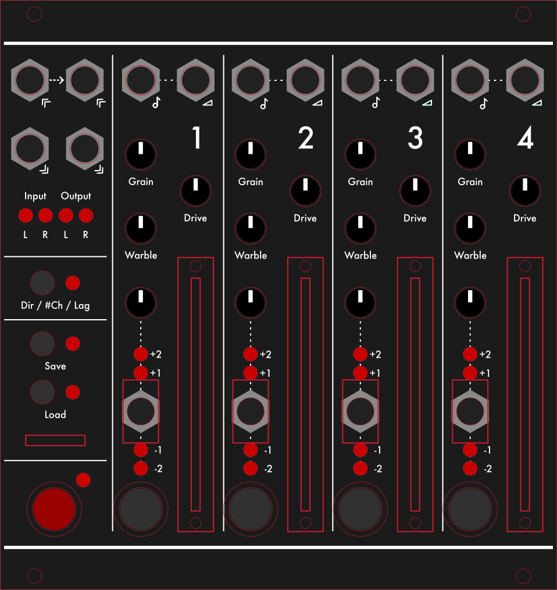

# TapeLooper

[](https://github.com/TheSlowGrowth/TapeLooper/actions/workflows/dsp.yaml)
[](https://github.com/TheSlowGrowth/TapeLooper/actions/workflows/firmware.yaml)
[](https://github.com/TheSlowGrowth/TapeLooper/actions/workflows/formatting.yaml)

A digital tape looper module for Eurorack or standalone use, built on the [Daisy Seed](https://electro-smith.com/product/daisy-seed/).



## Features

- **4 stereo or mono tape loop channels** - record and play back independent, unsynchronized tape loops
- **Motor simulation** - playback speed ramps up and down with a configurable rate
- **Tape simulation** - with drive, grain and warble independently controllable
- **Variable playback speed** - with Volt/Octave CV control and quarter/half/double/quad speed
- **Forward and reverse playback**
- **Amplitude CV control**
- **Clean recording** — audio records cleanly into loop channels; tape simulation is applied during playback only
- **Perfect loop recording** - with a small crossfade at the loop point
- **SD card storage** - save and load loops as 48kHz stereo WAV files

## Hardware

Based on the Electrosmith Daisy Seed. Designed to operate as either a Eurorack module or a standalone desktop unit.

## Project Structure

- `dsp/` — DSP library: audio processing, loop playback/recording, tape simulation
- `firmware/` — Target firmware: main application, UI, SD card I/O
- `hardware/` — KiCad PCB designs and panel artwork
- `lib/` — External dependencies
- `scripts/` — Development helper scripts

## Development

### Requirements

- **CMake** 3.30+
- **clang++** (C++17) for building and running unit tests
- **arm-none-eabi-gcc** 10-2020-q4 recommended for cross-compiling firmware to the Daisy Seed
- **Python 3** with `pip` (for pre-commit hooks)

### Unit Tests

Tests are written with Google Test. Build and run from the respective `tests/` directories:

```bash
# DSP library tests
cd dsp/tests && make test

# Firmware tests
cd firmware/tests && make test
```

### Pre-commit Hook

A pre-commit hook runs `clang-format` on staged files before each commit. To install:

```bash
./scripts/setup-clangformat-precommit-hook.sh
```
